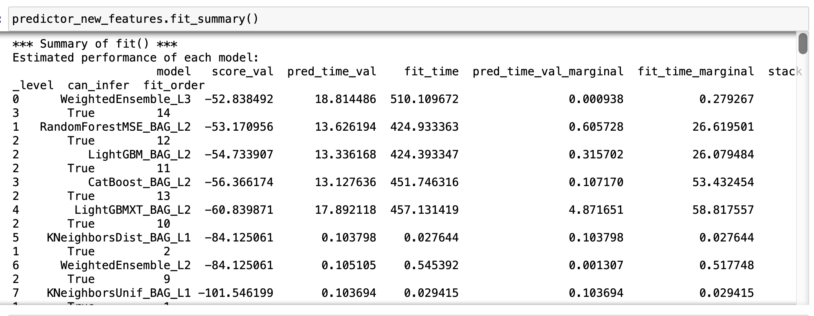
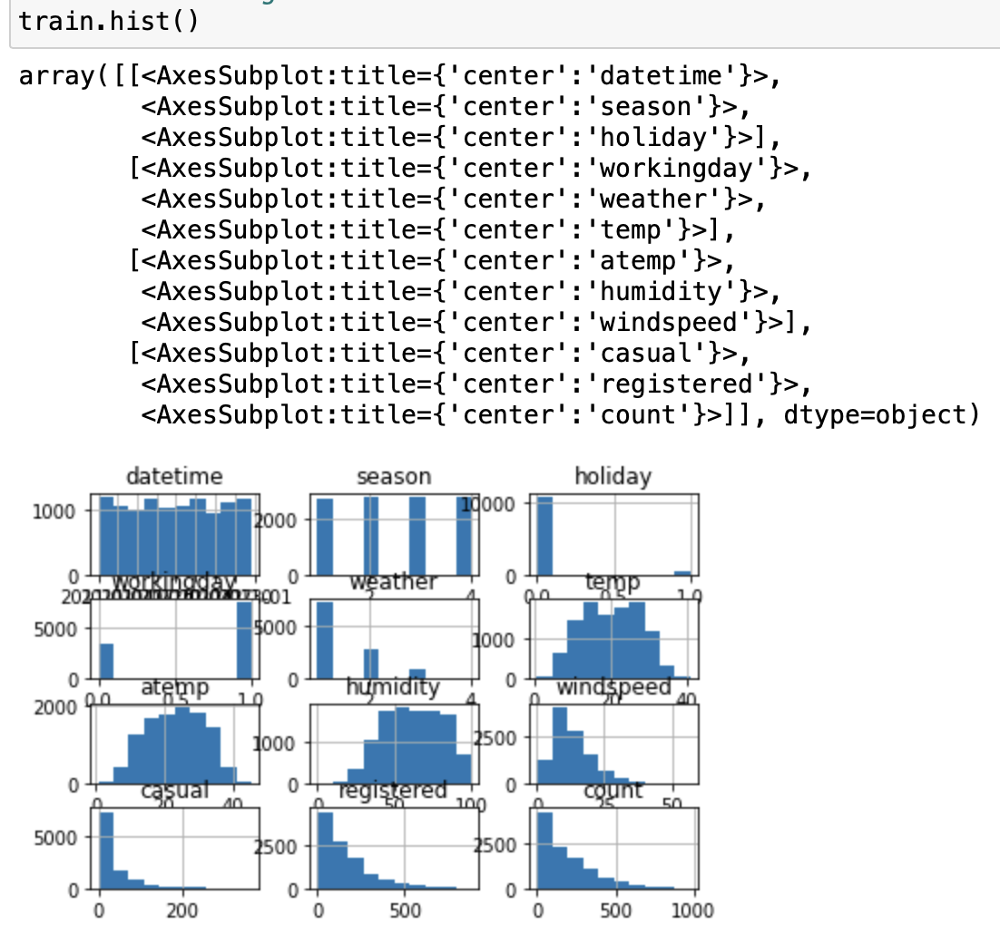
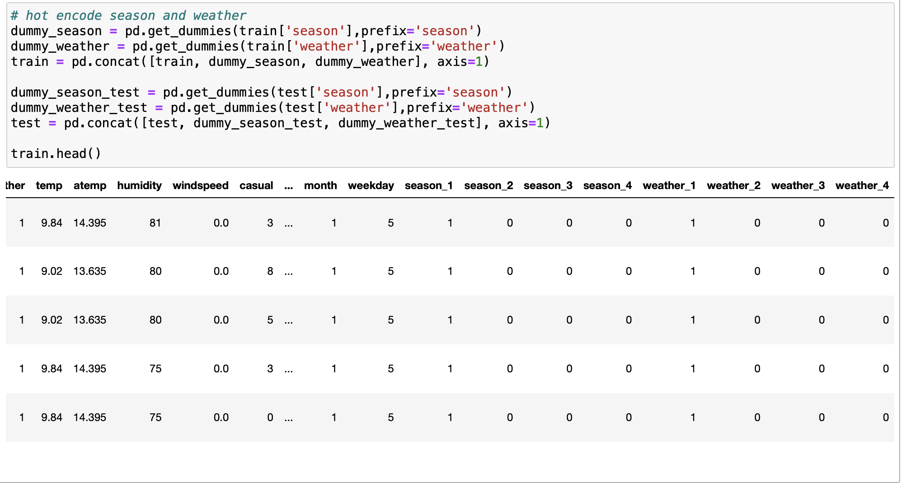
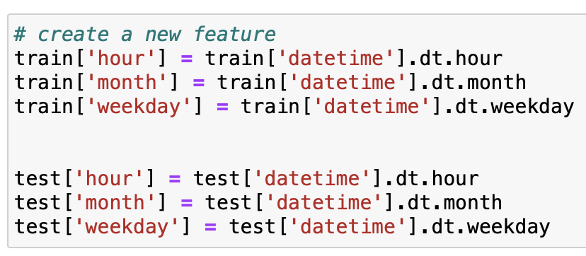
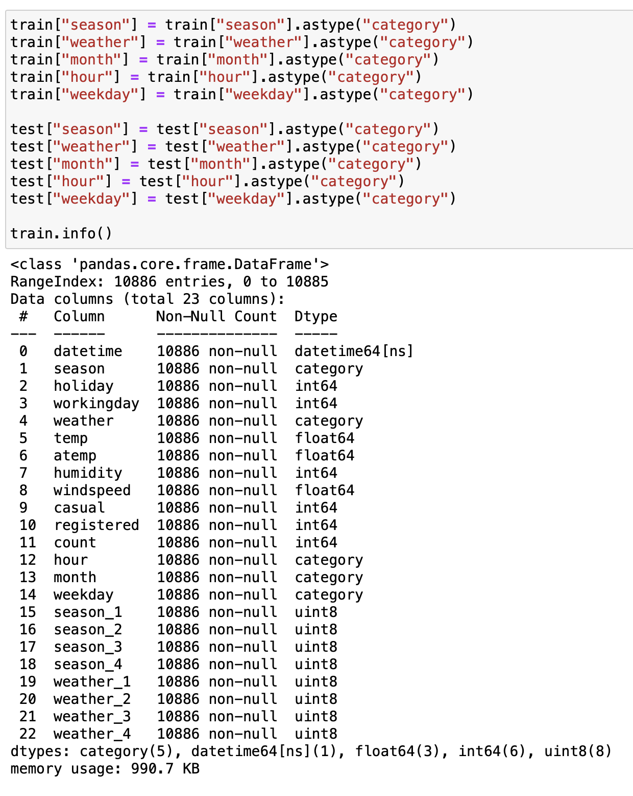
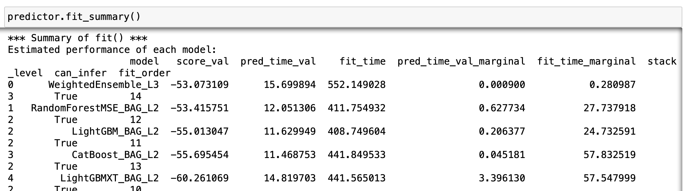
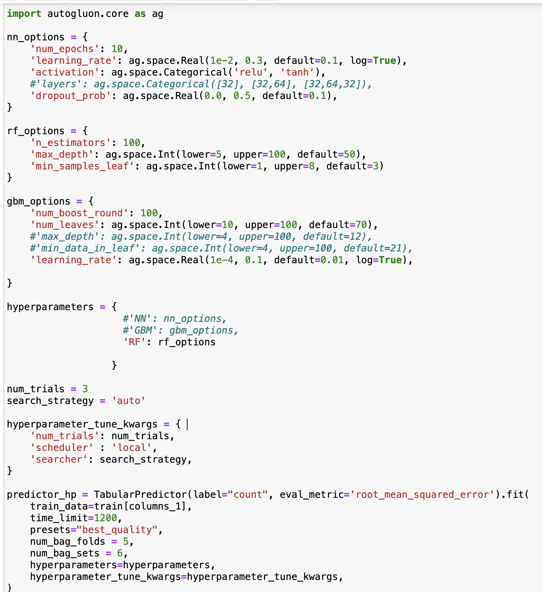
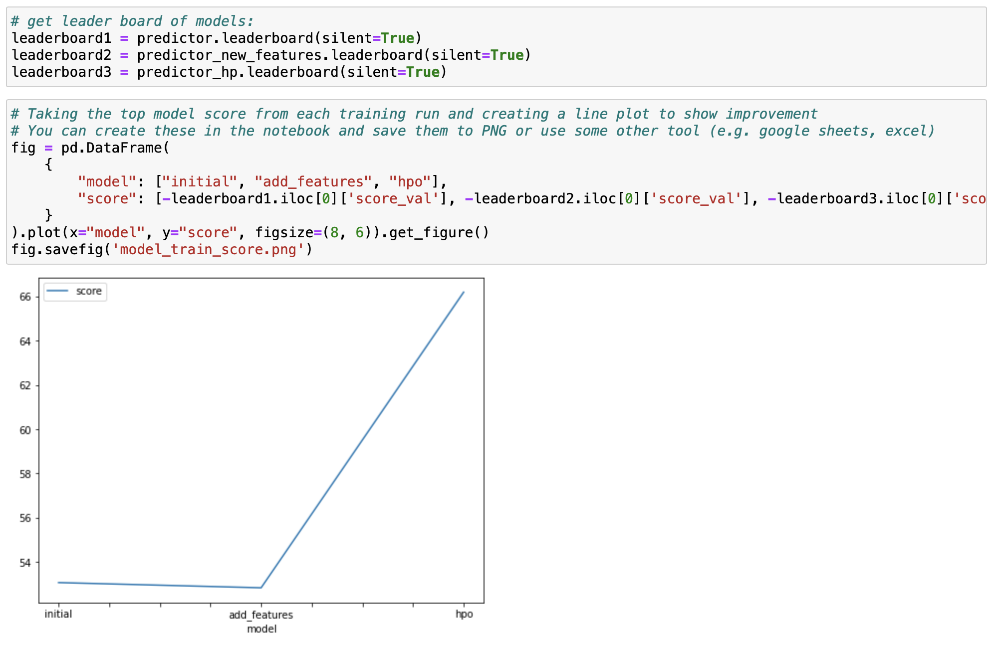
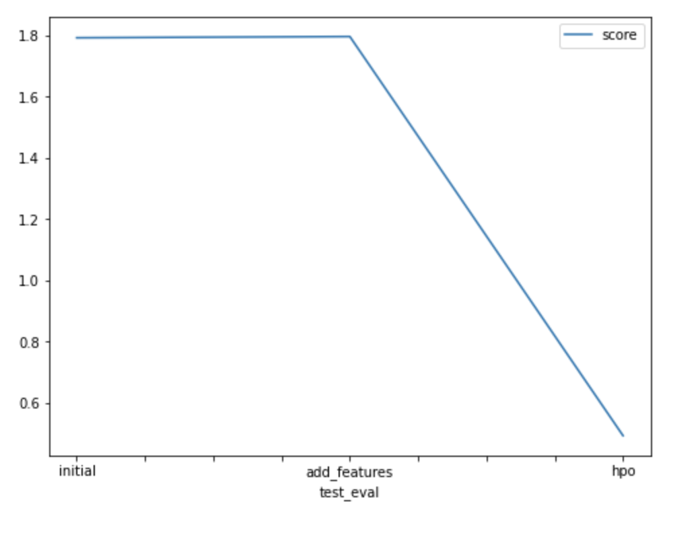

# Report: Predict Bike Sharing Demand with AutoGluon Solution
#### JOAN GERARD

## Initial Training
### What did you realize when you tried to submit your predictions? What changes were needed to the output of the predictor to submit your results?
Negative numbers in the prediction are not valid and the submission may be rejected due to this. We need to set this predictions to be 0 before submitting. The following piece of code shows us that there is not any negative number in our prediction but if we would like to move this to an automated pipeline that can occur so we need to take this case into account.

### What was the top ranked model that performed?
The one that worked bettter with the training data was the second one (with extra features). We can see a list of the top 8 models together with their validation scores and time. The number one was a *Weighted Ensamble* with that stacks together three models and gives to each different weights for prediction. It gives a score of **52.8**.

## Exploratory data analysis and feature creation

An EDA is a process that is needed previously to model selection and training. EDA helps you understand the details of your data such as number of features, max,min,std value for each feature, the type of each feature such as int, categorical, float, etc, how the data distribution for each feature looks like, what is the relation between each feature with the target output, etc. 

### What did the exploratory analysis find and how did you add additional features?

We can see the data distribution for each feature using the `hist()` command. We can see that the weather and season has 4 possible values so we can convert them to be categorical instead of int. Additionally, we can hot encode them as well. 

We can split the datetime feature into hour, weekday and month adding these new features to our dataset:

Finally, verify that the corresponding types look like we want and convert them if not.

### How much better did your model preform after adding additional features and why do you think that is?
The top base line model gives a score of -53.073 (Autogluon flips the sign because the greater the better and since we are using RMSE as a metric this works the other way around).

When we add new fetures to it, the top model gives a score of -52.838.

$increase_{perc} = \frac{final-initial}{|initial|}*100\% = \frac{-52.838+53.073}{|52.838|}*100\% = 0.44\%$

We can see that this last model is slightly better than the base line model with training data.

However, when we submit this model to Kaggle we obtain a score of 1.797 which is worst than 1.793 obtained in the first model. This represents a decrease of performance of 0.22%.

## Hyper parameter tuning

We tried Artificial Neural Networks, Random Forest and Gradient Boosting Model, each of them using its own hyperparameter configuration as it is shown here: 

### How much better did your model preform after trying different hyper parameters?

The model that gave us better result was Random Forest. It did not improve the base line model performance during training, the best run reported a score of -66.196 which represents a decrease of performance of 24% compared with the base line model. However, the model worked good with the kaggle prediction giving a score of 0.492 which represents 72% of increment in performance compared with the base line model. 

### If you were given more time with this dataset, where do you think you would spend more time?
It is necessary to spend more time doing feature engineering: 

- Discover the correlation between different features together with the target
- Analyse feature importance and filter the less important features out to re train the model. 
- Explore more models, more parameters, etc...

### Create a table with the models you ran, the hyperparameters modified, and the kaggle score.

|    | model        | hpo1                                                                                   | hpo2                                                          | hpo3                                                                   |   score |
|---:|:-------------|:---------------------------------------------------------------------------------------|:--------------------------------------------------------------|:-----------------------------------------------------------------------|--------:|
|  0 | initial      | default vals                                                                           | default vals                                                  | default vals                                                           |   1.793 |
|  1 | add_features | default vals                                                                           | default vals                                                  | default vals                                                           |   1.797 |
|  2 | hpo          | NN: num_epochs=10;learning_rate=[0.01-0.3];activation=[relu,tanh];dropout_prob=[0-0.5] | RF: n_estimators=100;max_depth=[5-100];min_samples_leaf:[1-8] | GBM: num_boost_round=100;num_leaves=[10-100];learning_rate=[0.001-0.1] |   0.492 |

### Create a line plot showing the top model score for the three (or more) training runs during the project.

### Create a line plot showing the top kaggle score for the three (or more) prediction submissions during the project.

## Summary
It is important to do a correct exploration of the data in order to have a good understanding of it. When we spend more time trying to figure out the relation between the features and the target, we have more chances to find a better model.

Autogluon is a very complete tool that works as a blackbox to test many models with different parameters. The more time we let autogluon execute, the more opportunities we have to find a better model. However, the documentation is not very descriptive nor intuitive and it is difficult to find examples online. 

